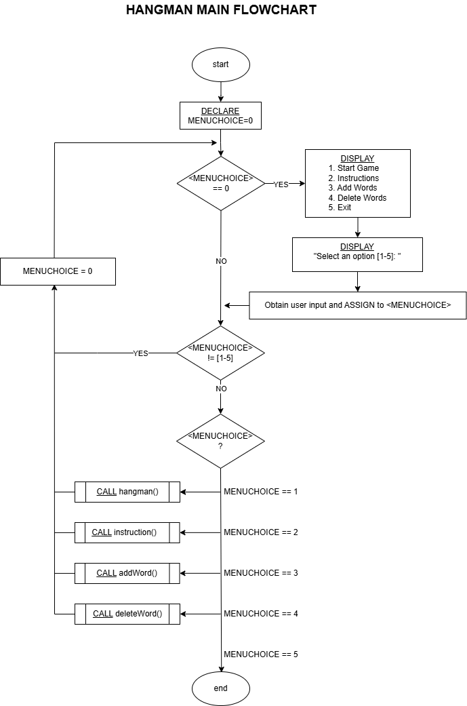

# Hangman Game (Bash Script Ver.)

This version of Hangman is implemented purely using **Linux Bash Shell Script**.
It demonstrates how to manipulate strings and files using native Linux commands without relying on external programming languages like C or Python.

## Logic Flow (Flowchart)

The diagram below illustrates how the game processes user input and manages game states.



---

## Pseudocode

The following pseudocode details the main gameplay loop, including word masking, user input validation, and win/loss condition handling.

```text
Purpose:
To execute the main gameplay loop of Hangman, including word selection, user input validation, game state updates, and win/loss condition handling.

Argument: N/A

Return: N/A

----------------------

hangman()

1. start

2. DECLARE: cont = "Y", correct, wrong, matched, wordCount, i, j

3. DECLARE guessWord, wrongWord, subject, word, guessLetter

4. i=0, j=0, correct = 0, wrong = 0, matched = 0, guessWord = "", wrongWord = ""

5. Select random word from file <wordBank.txt> and ASSIGN to <subject>, <word>

6. Calculate length of <word> and ASSIGN to <wordCount>

7. if (i < wordCount) ?

	7.1 if (word[i] == " ") ?

		7.1.1 guessWord += "  " 

	7.2 if (word[i] != " ") ?

		7.2.1 guessWord += "_ "

	7.3 i ++

	7.4 Go to #7

8. if (<wrong> < 6 AND <matched> != <wordCount>) ?

	8.1 DISPLAY "hangman picture #<wrong>" from <picture.txt>

	8.2 DISPLAY "Word Subject: <subject>"

	8.3 DISPLAY "Guess the word: <guessWord>"

	8.4 if (<wrong> > 0 AND <wrong> < 6) ?

		8.4.1 DISPLAY "You tried: <wrongWord>" 

	8.5 <guessLetter> = ""

	8.6 if (<guessLetter> != [a-zA-Z]) ?

		8.6.1 DISPLAY "Enter a letter(a-z)"

		8.6.2 Obtain user input and ASSIGN to <guessLetter>

		8.6.3 Go to #8.6

	8.7 correct = 0, j=0

	8.8 if (j < <wordCount>) ?

		8.8.1 if (<word[j]> == <guessLetter> AND guessWord[2*j] == "_") ?

			8.8.1.1 <correct> ++

			8.8.1.2 <guessWord> = <guessWord:0:(j*2)> + <guessLetter> + <guessWord:(j*2+1)>

		8.8.2 j++

		8.8.3 Go to #8.8

	8.9 if (<correct> == 0) ?

		8.9.1 <wrong> ++

		8.9.2 <wrongWord> += <guessLetter> + " "

	8.10 if (<correct> != 0) ?

		8.10.1 matched += <correct>

	8.11 Go to #8

9. if (<wrong> == 6) ?

	9.1 DISPLAY "hangman picture #<wrong>" from <picture.txt>

	9.2 DISPLAY "Game Over!"

	9.3 DISPLAY "The Word was: <word>"

10. if (<matched> == <wordCount>) ?

	10.1 i=0

	10.2 if (i<6) ?

		10.2.1 if (i%2 == 1) ?

			10.2.1.1 DISPLAY "hangman picture #final1" from <picture.txt>

			10.2.1.2 wait 0.3s

		10.2.2 if (i%2 == 0) ?


			10.2.2.1 DISPLAY "hangman picture #final2" from <picture.txt>									

			10.2.2.2 wait 0.3s

		10.2.3 i ++

		10.2.4 Go to #10.2

11. DISPLAY "Play again?(y/n)"

12 Obtain input and ASSIGN to <cont>

13. if (<cont> == "Y") ?

	13.1 Go to #4

14. end
```

---

```text
Purpose:
To allow the user to append new words and their corresponding subjects to the word bank file, with an option to repeat the process.

Argument: N/A

Return: N/A

----------------------

addWord()

1. start

2. DECLARE: cont = "Y", WORD, SUBJECT, SAVE_RESULT

3. if (<CONT> == "Y" OR <CONT> == "y" OR <CONT> == "Yes" OR <CONT> == "yes") ?

	3.1 DISPLAY "Enter a new word: " 
	
	3.2 Obtain user input and ASSIGN to <WORD>

	3.3 DISPLAY "Enter a Subject for guessing the word, <WORD>: " 
	
	3.4 Obtain user input and ASSIGN to <SUBJECT>

	3.5 APPEND "<SUBJECT> <WORD>" to file <wordBank.txt> 
	
	3.6 Check the result of the append operation and ASSIGN to <SAVE_RESULT>

	3.7 if (<SAVE_RESULT> == FAILURE) ? 
		
		3.7.1 DISPLAY "Failed to save the word." 
		
		3.7.2 <CONT> = "Y"

	3.8 if (<SAVE_RESULT> == SUCCESS) ? 
		
		3.8.1 DISPLAY "Word saved successfully."

	3.9 DISPLAY "Do you want to add more?(y/n): " 
	
	3.10 Obtain user input and ASSIGN to <CONT> 
	
	3.11 Go to #3
	
4. end
```

---

```text
Purpose:
To display the list of words from the word bank and allow the user to delete a specific word, updating the file accordingly.

Argument: N/A

Return: N/A

----------------------

deleteWord()

1. start

2. DECLARE: CONT = "Y", LINES, i, tmpWord, DELETETARGET, SEARCHING, DELETE_SUCCESS

3. if (<CONT> == "Y" OR <CONT> == "y" OR <CONT> == "Yes" OR <CONT> == "yes") ?

	3.1 Calculate total lines in <wordBank.txt> and ASSIGN to <LINES> 3.2 DISPLAY " WORD BANK"
	
	3.2 DISPLAY "WORD BANK"

	3.3 i = 1
	
	3.4 if (i <= <LINES>) ?

		3.4.1 Read line <i> from <wordBank.txt>, extract the word, and ASSIGN to <tmpWord>

		3.4.2 DISPLAY first 10 characters of <tmpWord> 
		
		3.4.3 if ((i % 4) == 0) ? 
			
			3.4.3.1 DISPLAY New Line 
			
			3.4.4 i ++ 
			
			3.4.5 Go to #3.4

	3.5 DISPLAY New Line 
	
	3.6 DISPLAY "Enter the word to delete: " 
	
	3.7 Obtain user input and ASSIGN to <DELETETARGET> 
	
	3.8 Remove file <tmp> (Initialize temporary storage)

	3.9 i = 1 
	
	3.10 if (i <= <LINES>) ? 
	
		3.10.1 Read line <i> from <wordBank.txt>, extract the word, and ASSIGN to <SEARCHING> 
		
		3.10.2 if (<DELETETARGET> == <SEARCHING>) ? 
		
			3.10.2.1 Copy all lines EXCEPT <DELETETARGET> from <wordBank.txt> to <tmp> 
			
		3.10.3 i ++ 3.10.4 Go to #3.10

	3.11 Move file <tmp> to <wordBank.txt> (Overwrite original file)

	3.12 Check if move operation failed and ASSIGN result to <DELETE_SUCCESS> 
	
	3.13 if (<DELETE_SUCCESS> == FALSE) ? 3.13.1 Remove file <tmp> (Cleanup)

	3.14 DISPLAY "Do you want to delete more?(y/n): " 3.15 Obtain user input and ASSIGN to <CONT> 3.16 Go to #3
	
4. end
```

