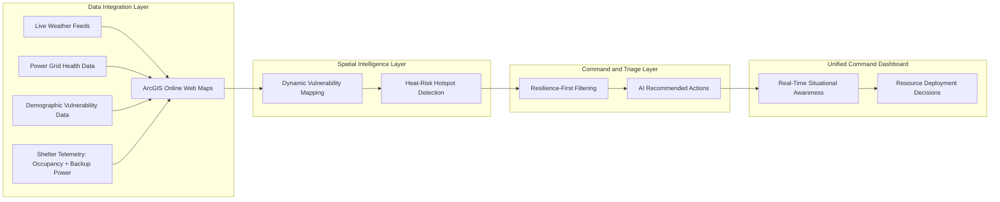

# Toronto Heat Resilience Command Dashboard
## DEMO DRIVE LINK:
TBD

## Problem Statement
Emergency response teams in large cities often rely on fragmented tools while handling heat emergencies.  
City coordinators must manually combine weather alerts, power infrastructure conditions, demographic risk, and shelter status, which slows down life-critical decisions.  
A passive citizen-facing map is not enough when vulnerable residents need immediate, precision-targeted intervention.

---

## Solution
This project delivers a proactive, real-time command-and-control dashboard for heat emergency response.  
It unifies weather, power, and social vulnerability data into one operational view so teams can identify hotspots, prioritize vulnerable populations, and deploy resources faster.

- Shift from passive monitoring to active emergency orchestration.
- Precision-target high-risk neighborhoods for equitable, life-saving impact.
- Generate clear next actions for coordinators during crisis windows.

---

## Features
- **Hotspot Identification** with multi-layer visualization of:
  - urban heat islands,
  - power grid stress,
  - low-income population density.
- **Resilience-Driven Triage** for filtering cooling centers by:
  - backup power availability,
  - real-time occupancy,
  - operational accessibility.
- **Rapid Resource Deployment** through automated recommended actions:
  - dispatch mobile cooling units,
  - deploy water trailers,
  - reroute citizens to viable shelters.
- **Unified Command Dashboard** to reduce tab-switching and decision fatigue.

---

## Overview
This solution is designed for:

- **Primary Audience:** Emergency Management Coordinators (City of Toronto)
- **Secondary Audience:** Public Health Officials and Community Outreach Teams

It transforms emergency operations with:

- **Dynamic Vulnerability Mapping** from live weather, demographics, and infrastructure health.
- **Resilience-First Filtering** with real-time shelter status awareness.
- **Automated Actionable Insights** using AI-driven triage logic.
- **Single-Pane Situational Awareness** for rapid command decisions.

---

## Business ROI
- **Economic (Cost-Effective):** Reduces unnecessary dispatches and failed evacuation attempts by optimizing resource allocation.
- **Technical:** Integrates fragmented weather, power, and social datasets seamlessly through the ArcGIS ecosystem.
- **Operational:** Centralizes command workflows to minimize cognitive load during emergencies.
- **Time:** Compresses decision cycles from hours of manual analysis to seconds of actionable insight.

---

## Architecture
The platform is organized into four operational layers:

### 1. Data Integration Layer
- Ingests weather forecasts, grid health indicators, demographic vulnerability signals, and shelter telemetry.
- Normalizes datasets through ArcGIS Online Web Maps.

### 2. Spatial Intelligence Layer
- Applies dynamic vulnerability overlays to identify high-risk zones.
- Detects hotspot intersections between heat severity, infrastructure strain, and social vulnerability.

### 3. Command & Triage Layer
- Filters response options using resilience-first rules (backup power, occupancy, accessibility).
- Produces AI-driven "Next Best Actions" for field operations.

### 4. Unified Dashboard Layer
- Provides one command surface for emergency coordinators.
- Supports rapid monitoring, decision-making, and deployment tracking.

---

## Architecture Diagram



---

## Tech Stack
- **Frontend:** React.js, Tailwind CSS
- **Mapping Engine:** ArcGIS Maps SDK for JavaScript
- **Data Architecture:** ArcGIS Online (Web Maps)
- **Core Language:** JavaScript (ES6+)

---

## Running Steps:

### 1. Install Frontend Dependencies
```bash
npm install
```

### 2. Start the Development Server
```bash
npm run dev
```

### 3. Configure ArcGIS Credentials
- Set ArcGIS API key or OAuth configuration in your environment settings.
- Connect required ArcGIS Online web maps and layers.

### 4. Launch and Validate Dashboard Layers
- Verify heat, grid, demographic, and shelter layers are loading correctly.
- Confirm recommendation panel updates as live conditions change.
